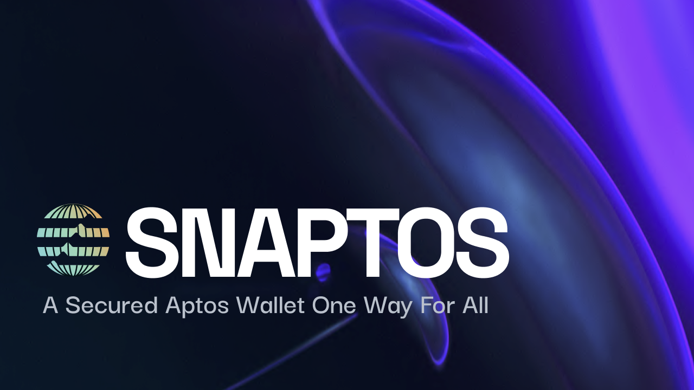
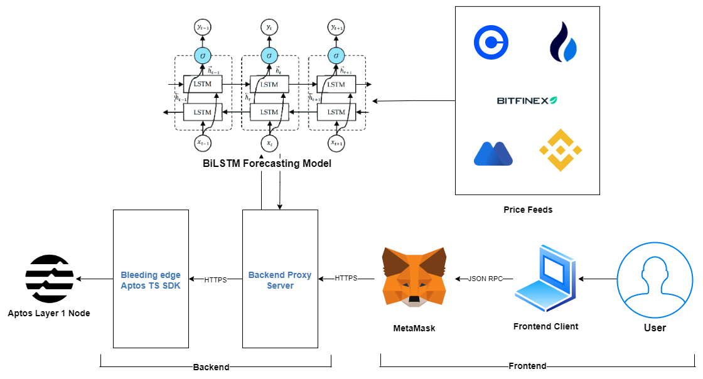

# Snaptos Wallet



Welcome to Snaptos Wallet, a Metamask Snap that brings support for the non-EVM L1 blockchain, Aptos. This feature-rich wallet is designed to provide users with a seamless experience for managing Aptos assets, executing transactions, and accessing various advanced functionalities, all within the familiar Metamask environment.

## Features

### 1. Aptos Asset Management
Easily store, send, and receive Aptos cryptocurrency within the Metamask Snap. Snaptos ensures a secure and efficient way to manage your Aptos assets without leaving the Metamask ecosystem.

### 2. Faucet for Testing and Development
Accelerate your development process with our built-in faucet. Obtain test and dev Aptos instantly for debugging and testing purposes, ensuring a smooth development experience.

### 3. Gas Estimation
No more guesswork! Aptos Wallet provides accurate gas estimation for transactions, allowing users to make informed decisions and optimize their transaction costs.

### 4. Transaction Log
Keep track of your transactions effortlessly. The transaction log provides a comprehensive overview of your Aptos transactions, enhancing transparency and accountability.

### 5. Real-time APT to USD Conversion
Stay updated with real-time Aptos to USD conversion rates directly within the wallet. This feature ensures users are always aware of the current value of their Aptos holdings.

### 6. On-chain Account Creation
Create Aptos accounts directly on-chain with just a few clicks. Aptos Wallet simplifies the account creation process, providing a single interface for all your account management needs.

### 7. Advanced APT to USD prediction model
Aptos Wallet leverages a sophisticated Bidirectional LSTM model to predict the future value of Aptos in USD. This feature provides users with a reliable and accurate forecast of Aptos price movements.

## How to Get Started

1. **Clone the Repository.**
2. **Install Dependencies:**
   ```bash
   yarn install
   ```
3. **Start the Server:**
   ```bash
   cd server
   npm start
   ```
4. **Return to the Root Directory:**
   ```bash
   cd ..
   ```
5. **Start the Forecasting Engine**
   Make sure you have Docker installed. If not, please follow the instructions [here](https://docs.docker.com/get-docker/).
   ```bash
   cd forecaster
   cd bin
   chmod +x deploy.sh
   ./deploy.sh up
   ```
5. **Start the Application**
   ```bash
   cd ..
   yarn start
   ```

Congratulations! You are now ready to experience the power of Snaptos. Access your Aptos assets, leverage advanced features, and enjoy a streamlined user experience right within the Metamask Snap.

## Notations

- **Gas Estimation:** Our sophisticated algorithm analyzes the current network conditions to provide accurate gas estimates, ensuring optimal transaction execution.

- **Real-time APT to USD Conversion:** The conversion rates are sourced from reputable APIs, offering users a reliable and up-to-date valuation of their Aptos holdings.

- **On-chain Account Creation:** Behind the scenes, Aptos Wallet leverages smart contract interactions to securely and efficiently create Aptos accounts directly on-chain.

- **Advanced APT to USD prediction model:** The forecasting engine is built using a Bidirectional LSTM model, which is trained on historical data to predict future Aptos price movements. We have trained the model on more than 500 continuous data points which we scraped ourselves from the internet through multiple sources/price feeds. The various model hyperparameters are:

  - **Number of LSTM layers:** 1
  - **Optimizer:** Adam
  - **Loss function:** Mean Squared Error
  - **Number of epochs:** 100
  - **Batch size:** 9
  - **Learning rate:** 0.001
  - **Lookback period:** 16 time units

## Architecture


## Why LSTM?
- Given the highly volatile nature of the crypto market, we need a model that can capture the non-linearities and complexities of the data. Simple statistical algorithms like ARIMA and SARIMA are not suitable for this task as they are not able to capture the non-linearities and complexities of the data. CNNs, RNNs and their variations have proved to be very effective in forecasting complex time series data. We have used LSTM as it is a very powerful variation of RNNs and is able to capture long term dependencies in the data. We have used a Bidirectional LSTM as it is able to capture the dependencies in both the directions of the time series data.
- Although RNNs and CNNs were meant for time series data, they usually falter at remembering long term dependencies in the data. LSTMs and GRUs were made to overcome this limitation and thus here we have used LSTMs, which are a superior version of RNNs.

## Authors
This project has been made for Inter IIT Tech meet 23 by Insitute/Team id 46.

## References
- Patel, Mohil Maheshkumar, et al. "A deep learning-based cryptocurrency price prediction scheme for financial institutions." Journal of information security and applications 55 (2020): 102583. https://doi.org/10.1002/isaf.1488
- Khedr, Ahmed M., et al. "Cryptocurrency price prediction using traditional statistical and machine‐learning techniques: A survey." Intelligent Systems in Accounting, Finance and Management 28.1 (2021): 3-34. https://doi.org/10.1002/isaf.1488
- Pintelas, E., Livieris, I.E., Stavroyiannis, S., Kotsilieris, T., Pintelas, P. (2020). Investigating the Problem of Cryptocurrency Price Prediction: A Deep Learning Approach. In: Maglogiannis, I., Iliadis, L., Pimenidis, E. (eds) Artificial Intelligence Applications and Innovations. AIAI 2020. IFIP Advances in Information and Communication Technology, vol 584. Springer, Cham. https://doi.org/10.1007/978-3-030-49186-4_9
